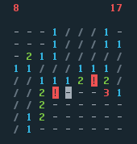

# Mines

A minesweeper clone in the terminal, written in Elixir.

I built this to learn Elixir and as an exercise in test-driven development.

## Build

Mines is meant to be run as a standalone BEAM executable:

    mix escript.build

## Play

To play the game with default settings, run:

    ./mines

Currently, you can also pass two arguments to the game:

    ./mines --size 10 --mines 12

### Controls

* The arrow keys move the cursor. The cursor wraps around the edges of the board.
* The space bar reveals a cell.
* The 'b' key toggles marking a cell as a bomb.
* Control-C exits the game. (You'll probably need to call `reset` afterwards.)
